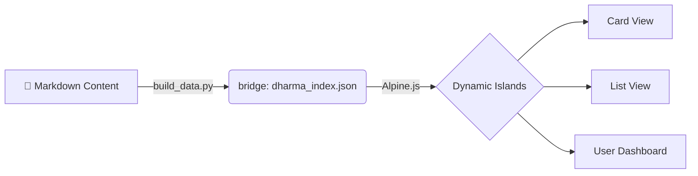

# DharmaBase
**The Personal Knowledge Base & Interactive Web Book Engine**

DharmaBase는 정적 웹사이트의 **안정성**과 최신 웹 앱의 **상호작용**을 결합한, 당신만의 지식 수행(Learning) 플랫폼입니다.

[Demo](https://biwoom.github.io/DharmaBase-DEV/)

---

## Core Philosophy

DharmaBase는 **"가볍고, 직관적이며, 영원한"** 지식 저장소를 지향합니다.

*   **Lightweight & Fast**: **Zensical** 엔진 기반. 빌드 시점에 HTML 확정. 비약적으로 빠른 속도와 무료 호스팅.
*   **Local-First & Private**: 학습 데이터(북마크, 하이라이트, 메모)는 서버가 아닌 **브라우저(LocalStorage)**에 저장. 완벽한 프라이버시.
*   **Island Architecture**: 정적 페이지(The Sea) 위에 필요한 기능만 수행하는 동적 섬(The Islands)을 결합.

## Key Features

### 1. Interactive Views
*   **Kanban Card View**: 챕터별 카드 시각화, 학습 상태 뱃지, 자동 정렬.
*   **List View**: 엑셀 스타일의 대량 문서 관리, 다중 키워드 필터링.

### 2. Seamless Reading Experience
*   **Slide-Over Reader**: 목록에서 클릭 시 페이지 이동 없이 우측 패널에서 문서를 즉시 열람.

### 3. Personalization
*   **Highlight & Memo**: 형광펜 밑줄 및 메모 작성.
*   **User Dashboard**: '나의 서재'에서 학습 현황 및 북마크 관리.
*   **Persistent**: 브라우저 기반 영구 저장.

## How It Works

오직 **마크다운(Markdown)** 파일만 작성하면 됩니다.

1.  **Write:** `docs/` 폴더에 마크다운 작성.
2.  **Build:** `build_data.py`로 메타데이터 추출.
3.  **View:** 웹북으로 자동 변환.

## Commands

*   `python scripts/build_data.py`: 데이터 빌드 (필수)
*   `zensical serve`: 로컬 프리뷰 실행
*   `git push`: GitHub Actions를 통한 자동 배포

-----

Powered by **Zensical** & **Alpine.js** | Designed for Deep Learning