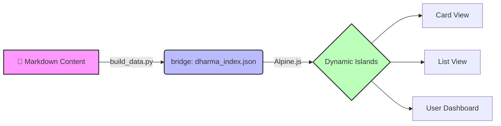

# DharmaBase
**The Personal Knowledge Base & Interactive Web Book Engine**

DharmaBase는 단순한 문서 뷰어가 아닙니다. 정적 웹사이트의 **안정성**과 최신 웹 앱의 **상호작용**을 결합한, 당신만의 지식 수행(Learning) 플랫폼입니다.

[프로젝트 : GitHub][get-started]{ .md-button .md-button--primary }
[기능 살펴보기 : Features][features]{ .md-button }

  [get-started]: https://github.com/biwoom/DharmaBase-DEV
  [features]: #key-features

---

## Core Philosophy

DharmaBase는 **"가볍고, 직관적이며, 영원한"** 지식 저장소를 지향합니다. 우리는 복잡한 서버나 데이터베이스를 거부합니다.

-   :lucide-feather: __Lightweight & Fast__

    ---

    **Zensical** 엔진을 기반으로 빌드 시점에 모든 콘텐츠가 HTML로 확정됩니다. 로딩 속도가 비약적으로 빠르며, 호스팅 비용이 들지 않습니다.

-   :lucide-hard-drive-download: __Local-First & Private__

    ---

    당신의 학습 데이터(북마크, 하이라이트, 메모)는 서버가 아닌 **당신의 브라우저(LocalStorage)**에 저장됩니다. 완벽한 프라이버시를 보장합니다.

-   :lucide-layout-template: __Island Architecture__

    ---

    정적 페이지라는 **바다(The Sea)** 위에, 꼭 필요한 기능만 수행하는 **동적 섬(The Islands)**을 띄웠습니다. 안정성과 기능성, 두 마리 토끼를 잡았습니다.

## Key Features

DharmaBase는 단순한 읽기를 넘어, 지식을 구조화하고 관리하는 강력한 도구를 제공합니다.

### 1. Interactive Views

문서의 성격에 따라 최적화된 뷰를 선택할 수 있습니다.

=== "Kanban Card View"

    **시각적 탐색을 위한 보드**
    
    * 문서를 챕터별 카드로 시각화하여 전체 흐름을 한눈에 파악합니다.
    * 학습 상태(대기/진행/완료)에 따라 뱃지가 자동으로 표시됩니다.
    * 드래그 앤 드롭이 아닌, 데이터 기반의 자동 정렬을 지원합니다.

=== "List View"

    **데이터베이스 스타일 그리드**
    
    * 엑셀처럼 대량의 문서를 관리합니다.
    * **다중 필터링:** "1장 완료 핵심" 처럼 여러 키워드로 문서를 정밀하게 검색합니다.
    * 챕터별 탭 네비게이션으로 빠르게 이동할 수 있습니다.

### 2. Seamless Reading Experience

!!! success "The Slide-Over Reader"
    목록을 보다가 문서를 클릭했을 때, 페이지가 이동하지 않습니다. 우측에서 **슬라이드 패널**이 부드럽게 열리며 내용을 보여줍니다. 목록의 맥락을 잃지 않으면서 빠르게 내용을 훑어보세요.

### 3. Personalization (V1.0)

이곳은 당신만의 책입니다. 마음껏 밑줄을 긋고 메모를 남기세요.

* **Highlight & Memo:** 마우스로 텍스트를 드래그하여 형광펜을 칠하고, 떠오르는 생각을 메모하세요.
* **User Dashboard:** '나의 서재'에서 학습 진도율과 북마크, 메모를 한눈에 모아보세요.
* **Persistent:** 브라우저를 닫았다 열어도 당신의 흔적은 그대로 유지됩니다.

## How It Works

DharmaBase는 복잡한 설치가 필요 없습니다. 오직 **마크다운(Markdown)** 파일만 작성하면 됩니다.

1.  **Write:** `docs/` 폴더에 마크다운으로 글을 씁니다.
2.  **Build:** 자동으로 메타데이터가 추출되어 `dharma_index.json`이 생성됩니다.
3.  **View:** 브라우저에서 아름다운 웹북으로 변환된 지식을 탐험합니다.

## Commands

DharmaBase는 **데이터 전처리(Pipeline)**와 **자동 배포(CI/CD)**로 관리됩니다.

* `python scripts/build_data.py` - **Step 1: Data Build**
    * 문서의 메타데이터를 추출하여 `dharma_index.json`을 생성합니다.
    * 로컬 서버를 띄우기 전에 반드시 실행해야 카드 뷰와 검색 기능이 작동합니다.

* `zensical serve` - **Step 2: Local Preview**
    * 로컬 웹 서버를 실행하여 변경 사항을 실시간으로 확인합니다.

* **Deployment (GitHub Actions)**
    * 별도의 빌드 명령어가 필요 없습니다.
    * `git push`로 코드를 저장소에 올리면, **GitHub Actions**가 자동으로 `zensical build`를 수행하고 배포합니다.

-----

*Powered by **Zensical** & **Alpine.js*** | *Designed for Deep Learning*